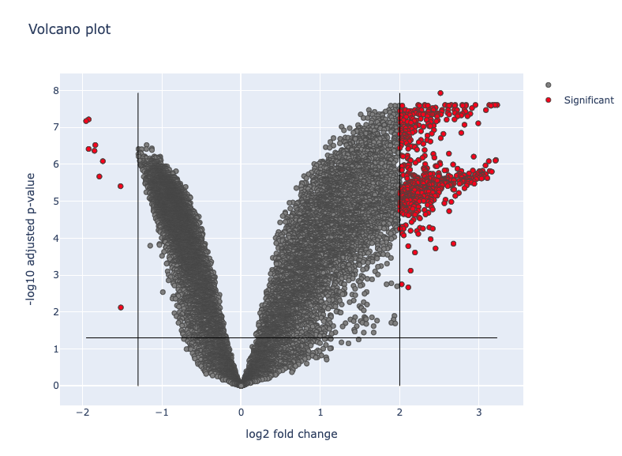

# Captsone Gene expression analysis in breast cancer

## Introduction

The systems biology approach to understanding diseases, including cancer, is transforming the way we approach drug discovery and treatment strategies. Rather than focusing on a single "magic-bullet" therapy targeting one gene or protein, systems biology acknowledges the inherent complexity in biological systems. This approach posits that diseases arise from a complex interplay of multiple genetic factors, environmental influences, and even elements such as tissue type, hormone levels, and age.

In the context of cancer, this could mean that a single cancer type might be the result of various unique combinations of mutated genes and environmental factors. The same cancer type in different individuals might require different treatment strategies, a concept central to personalized medicine. Systems biology provides the tools to explore this complexity. For example, it allows the mapping of intricate signaling networks composed of chemicals, hormones, protein receptors, enzymes, transcription factors, ions, or DNA/RNA that underlie each physiological process.

With the advent of high-throughput genomic, proteomic, and phosphoproteomic studies, the systems biology approach becomes even more feasible and powerful. Techniques such as genome-wide association studies (GWAS) and high-throughput proteomic experiments can generate vast amounts of data about the various components of these biological networks. Short hairpin (sh)RNA or siRNA experiments can give insights into how altering the expression of specific genes influences the overall system, highlighting potential therapeutic targets.

This flood of data from multiple sources, including gene mutation databases like the Online Mendelian Inheritance in Man (OMIM) or the Catalogue of Somatic Mutations in Cancer (COSMIC), has laid the foundation for a more network-based understanding of diseases. By examining the genes that harbor mutations in diseases as parts of a network, researchers can gain insights into the broader network properties of these nodes (genes).

Ultimately, the systems biology perspective opens up new avenues for drug discovery and cancer treatment. By considering the disease as a result of perturbations in an interconnected network, we can identify multiple points for therapeutic intervention. This multifaceted approach offers a more comprehensive and flexible strategy for managing complex diseases like cancer. It's a shift away from the 'one-size-fits-all' model towards personalized medicine, with treatments designed to target the specific network perturbations underlying an individual's disease.

## Methodology

The key steps to perform Gene expression analysis should follow the following step by step approach:
1.  Data Processing: 
	1. Normalizing the expression data (depending on the source of the data : ChipSeq, mRNA, etc)
	2. Log-transform the expression to make the data more normally distributed
	3. Analyse samples for outliers (due to measurement biais/errors, etc)
2.  Differential expression analysis
	1. Perform a differential expression analysis between the control and drug groups to identify differentially expressed genes (DEGs) using tools such as fold change, DESeq2, edgeR, or limma.
	2.  Apply a statistical test (e.g., t-test, ANOVA) and adjust for multiple testing using methods like the Benjamini-Hochberg procedure.
	3.  Select a cutoff (e.g., fold change > 2 and adjusted p-value < 0.05) to identify significantly differentially expressed genes. this can be represented in the Volcano plot
3.  Perform Gene enrichment analysis:
	1. Comparing the expression of gene sets 
4.  Gene Ontology and pathway enrichment analysis:
	Databases like Gene Ontology (GO) or KEGG to see if the DEGs or enriched gene sets are associated with particular biological processes, cellular components, or molecular functions (GO), or specific biological pathways (KEGG).
5.  Investigate the mechanism of action and potential combination therapy:
	1. Integrate the results of the differential expression analysis and functional enrichment analysis to propose a possible mechanism of action for PDC-100.
	2. Assess if there is any in silico evidence supporting the combination of a STAT3 inhibitor with PDC-100 for better therapeutic responses.

The dataSet received are two CSVs of CCLE format: RMA-normalized mRNA expression data. 1. Cell Lines treated with vehicle for 48 hours (Control Group) 2. Cell Lines treated with 300µM of PDC-100 for 48 hours (Drug Group). Previous studies have shown that 300µM of PDC-100 induced significant apoptosis in this panel of breast cancer cell lines. There are transcriptomic data from five different human breast cancer cell lines.

1.  MDA-MB-453: This cell line is derived from a metastatic site (pleural effusion) of a human breast carcinoma. It is characterized as a luminal androgen receptor (LAR) subtype of triple-negative breast cancer (TNBC) and is known to have an active androgen receptor signaling pathway.
    
2.  MDA-MB-231: This cell line is derived from a metastatic site (pleural effusion) of a human breast adenocarcinoma. MDA-MB-231 is a triple-negative breast cancer (TNBC) cell line and is often used as a model for studying aggressive breast cancers.
    
3.  MDA-MB-468: This cell line is also derived from a metastatic site (pleural effusion) of a human breast adenocarcinoma. MDA-MB-468 is another triple-negative breast cancer (TNBC) cell line and is frequently used in breast cancer research due to its aggressive nature and high proliferation rate.
    
4.  BT-549: This cell line is derived from a human breast ductal carcinoma. BT-549 is classified as a basal-like breast cancer (BLBC) cell line and is also triple-negative. This cell line exhibits characteristics of epithelial-mesenchymal transition (EMT), which is associated with cancer invasiveness and metastasis.
    
5.  CAL-851: This cell line is derived from a human breast carcinoma. CAL-851 is a poorly characterized breast cancer cell line, and limited information is available regarding its molecular and phenotypic properties.

## Questions

**Genomic Signatures of Drug Resistance in Breast Cancer**

### 1. Is there any gene signature involved in therapeutic response of this new drug?

Since the data are already RMA-normalized mRNA expression data, we simply apply a min max normalisation to have the data on the same range. The data does not ressemble a normal distribution, therefore we apply a log transform.

Then we compute the DEG (differentially expressed genes) by computing the fold change of the control group vs drug group. We also compute the statistical significance of that change using a t-test. There is some high variability across the different cell lines leading to non conclusive t-tests. 
We can however use a more appropriate method: the [[limma model]]. It leads to more interpretable results: 

The gene signature of those significantly expressed genes is not particularly explicit. Looking at the most important  Gene sets of Humans (KEGG_2021_Human) we find a strong matching for the following gene sets:
![[Pasted image 20230511100011.png]]

which is not particularly relevant to our case.

However there are some genes that have consistent increase over the 5 cell lines and have lower p values. We analyse those genes and saw the follow: 

![[Pasted image 20230510140950.png]]
![[Pasted image 20230510141056.png]]

We see that we have less consistency on the positive change across cell lines. Taking the first 50 genes both negative an positive change and comparing them to the KEGG_2021_Human:
![[Pasted image 20230511100055.png]]
 which seems to be more relevant to our context of breast cancer.

### 2. What is the possible mechanism of action in terms of controlling signaling pathways involved in therapeutic response to this new drug?

Using Expression to Kinases (https://maayanlab.cloud/X2K/results ) on the differentially expressed genes we are able to:
1. identify the transcription factors potentially regulating those differentially expressed genes
2. Then using genes 2 networks or protein protein interactions we can find connections between those transcription factors to build a subnetwork of protein protein interactions.
3. We take the subnetwork of protein  as a list and feed it to the Kinase enrichment analysis
4. We identify the kinases that are most likely regulating those proteins. 

It seems (https://reactome.org/) that the transcription factor **MYC** which is involved in multiple signaling pathways is affected and affecting cell proliferation, survival and angiogenesis. Many of the other transcription factors found are related to signaling and repairing DNA break ( R-HSA-9701192). **BRAC1** seems particularly important in breast cancer (R-HSA-9663199): Germline mutations in the BRCA1 or BRCA2 tumor suppressor genes are implicated in up to 10% of breast cancers overall and 40% of familial breast cancers.

We found the following kinases that were most impacted in the regulation of the subnetwork of proteins are the following: 
GSK3B, MAPK14, CSNK2A1,CDK4,CK2ALPHA
- **GSK3B**: protein kinase that plays important roles in various cellular processes, including cell signaling, metabolism, gene expression, and development. Abnormal GSK3B activity has been observed in cancer cells, where it can promote cell proliferation and survival.
- **MAPK14**: The activation of MAPK14 regulates a variety of cellular functions, including cell proliferation, differentiation, apoptosis, inflammation, and immune responses. In cancer, MAPK14 signaling can promote tumor cell survival, proliferation, invasion, and metastasis.
- **CSNK2A1**:  It plays a role in regulating various cellular processes, including cell division, proliferation, and survival. . CK2 inhibitors have been developed as potential therapeutic agents for cancer treatment, as CK2 is often dysregulated in cancer cells and contributes to tumor growth and survival
- **CDK4**: plays a key role in cell cycle regulation. Alterations in the CDK4 gene can result in aberrant cell cycle regulation and contribute to the development of cancer.
- **CK2ALPHA**:  It is one of the catalytic subunits of the casein kinase 2 (CK2) enzyme. CK2α has been found to be upregulated or hyperactivated in many cancer types, contributing to tumor growth, survival, and resistance to therapy.

We see that all of those kinase play a critical role in the cell survival rate and proliferation. 
As this analysis comes from differentially expressed genes due to the drug, we see that it may directly impact the expression of the BRAC1 tf for example, impacting a critical pathway in breast cancer.

### 3.  Is there any _in silico_ evidence that a STAT3 inhibitor can be combined with PDC-100 to get better therapeutic responses?

STAT3 is a signal transducer and activator of transcription 3. STAT3 is broadly hyperactivated both in cancer and non-cancerous cells within the tumor ecosystem and plays important roles in inhibiting the expression of crucial immune activation regulators and promoting the production of immunosuppressive factors. Therefore, targeting the STAT3 signaling pathway has emerged as a promising therapeutic strategy for numerous cancers.

We can obtain cell lines treated with STAT3 and perform a similar analysis as before. We can then compare both DEGs by overlapping the results. However the NIH (https://www.ncbi.nlm.nih.gov/) doesn't provide comparable cell lines treated with STAT3. We therefore look for more general approaches related to STAT3:
According to the Kinases and transcription factors related to STAT3 at https://maayanlab.cloud/archs4/gene/STAT3 are the following: ERN1, TRIB3, JAK3, TYK2, MAP4K1, ... 
They do not overlap with the one found before. The STAT3 inhibitor and the initial drug are affecting different targets, using them in combination might result in a broader, more effective response. This could be especially beneficial if the disease state involves alterations in multiple pathways.

The following article, Zou, S., Tong, Q., Liu, B., Huang, W., Tian, Y., & Fu, X. (2020). Targeting STAT3 in Cancer Immunotherapy. Molecular Cancer, 19, 145. https://molecular-cancer.biomedcentral.com/articles/10.1186/s12943-020-01258-7, details the integration of STAT3 inhibitors with other techniques. It seems that the current situation remain unclear as  "predictive biomarkers are urgently required to rationally incorporate STAT3 inhibitors into the combination immunotherapy."

## Discussion

Our investigation has provided compelling preliminary evidence suggesting that PDC-100 could potentially play a significant role in cancer treatment. The gene expression profile altered by PDC-100 indicates a modulation of biological pathways closely associated with tumorigenesis. Specifically, PDC-100 appears to suppress the expression of genes linked to cell proliferation, a fundamental characteristic of cancer cells, while simultaneously promoting the expression of genes involved in apoptosis, a process often dysregulated in cancer.

These findings align with previous knowledge on the necessity of tightly controlled balance between cell proliferation and cell death for maintaining normal tissue homeostasis. Disruptions in this balance, particularly when it tips towards excessive proliferation and insufficient apoptosis, contribute significantly to cancer development and progression. Thus, the ability of PDC-100 to seemingly restore this balance at a genetic level presents a promising therapeutic avenue.

To solidify our understanding of PDC-100's impact on cell proliferation and apoptosis, future investigations could focus on quantifying these processes directly in cancer cell lines treated with varying dosages of PDC-100. Such in vitro experiments would provide valuable insights into the dose-dependent effects of PDC-100 and help define an optimal therapeutic window.

Furthermore, our exploration of potential synergistic effects with STAT3 inhibitors suggests an interesting direction for combination therapy. STAT3, a critical mediator in many cellular processes, has been implicated in cancer development and resistance to therapies. Therefore, combining a STAT3 inhibitor with PDC-100 could potentially enhance therapeutic efficacy. However, it is crucial to note that STAT3 inhibitors can have broad effects, given the wide range of pathways in which STAT3 is involved. Therefore, meticulous in vitro testing is needed to assess their impact on cancer cell lines and to scrutinize any unintended effects on non-cancerous cells.

Our study, while providing encouraging insights, is an initial step in understanding the therapeutic potential of PDC-100. Moving forward, it would be advantageous to conduct comprehensive in vitro and in vivo experiments to validate our in silico findings and to further explore the possibilities of combination therapy with STAT3 inhibitors.